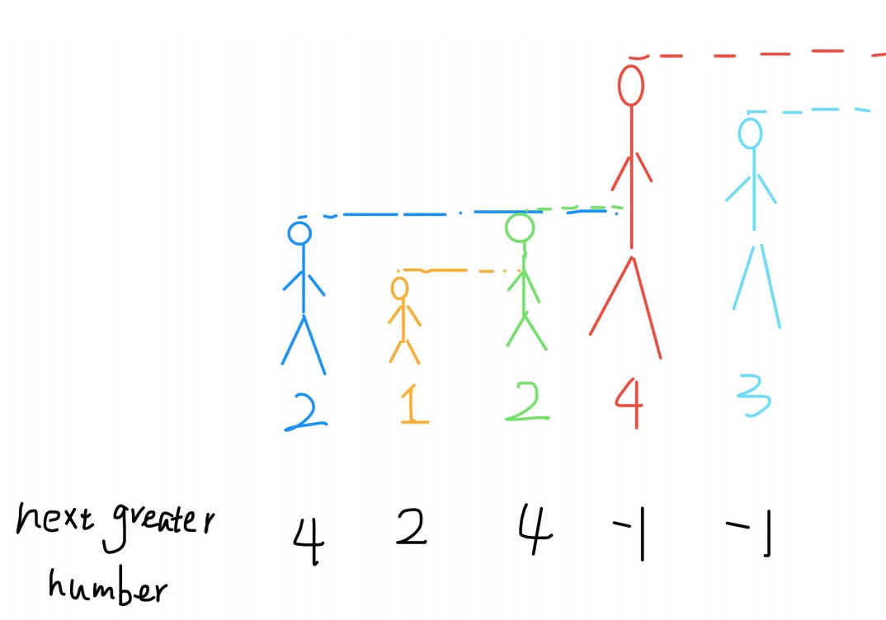

# section1 单调栈.md

# 定义
栈内的元素按照某种方式排序下单调递增或单调递减，如果新入栈的元素破坏的单调性，就弹出栈内元素，直到满足单调性。

# 实战
**例题:**  
给你⼀个数组，返回⼀个等⻓的数组，对应索引存储着下⼀个更⼤元素，如果没有更⼤的元素，就存-1。直接上⼀个例⼦： 给⼀个数组 [2,1,2,4,3]，需要返回数组 [4,2,4,-1,-1]。  
**解释:**  
第⼀个2大的后面的数4; 比1⼤的后面的数是2；第⼆个2后⾯⽐2⼤的数是4; 4后⾯没有⽐4⼤的数，填-1；3后⾯没有⽐3⼤的数，填-1。  
**解答:**
```python
# 单调栈
class MonotoneStack:
    def __init__(self):
        self.stack = []

    def push(self, v):
        if not self.stack:
            self.stack.append(v)
            return
        
        while self.stack and self.stack[-1] < v:
            self.stack.pop()
        
        self.stack.append(v)

    def pop(self):        
        if not self.stack:
            return
        return self.stack.pop()
    
    def top(self):
        if not self.stack:
            return
        return self.stack[-1]
    
    def second(self):
        if len(self.stack) < 2:
            return
        return self.stack[-2]

if __name__ == '__main__':
    mono = MonotoneStack()
    case = [2,1,2,4,3]
    results = []
    for v in case[::-1]:
        mono.push(v)
        r = mono.second()
        results.append(r if r is not None else -1)
    results = results[::-1]
```
**理解:**  

**性质:**
- 单调递减栈：
  - 栈顶：最新的值
  - 栈顶-1：最新值前最近的较大的值
  - 栈底：截止最新值时的整体 max
- 单调递增栈：和递减栈相反

# 提单
- [x] 239.滑动窗口最大值

# 解析
### 239.滑动窗口最大值
> 单调递减栈(栈顶就是最新的值，栈顶 -1 就是最新值前最近的较大的数，栈底就是截止最新值时的整体 max)  
> 注意每次窗口右异时，需要将 start 和栈底比较，如果相等则 pop 栈底；
